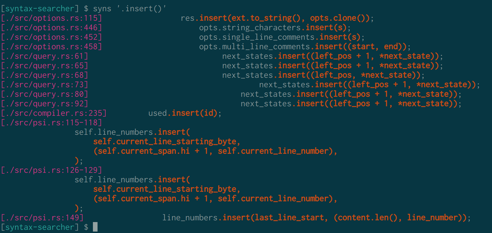

Syntax-searcher
===============

Language-independent command-line utility for syntax-aware pattern matching.



- Language-independent, works for most languages
- Simple regex-like search patterns
- Easily search things like
    - Struct definitions: `syns 'struct Span { }' src/psi.rs`
    - Function signatures: `syns 'int fprintf ( )' /usr/include/stdio.h`
    - SQL injections: `syns '\"INSERT.*" +' src/db/db_service.scala`

Standard regular expressions are not powerful enough to parse arbitrary
paren-delimited expressions. This makes it hard to search for specific
patterns, such as passing dangerous parameters to a function, without hitting
false positives. `syns` allows searching arbitrary source code files using
regex-like patterns.

Installing
==========

1) Install Rust eg. using [Rustup](https://rustup.rs/).
2) Clone this repository: `git clone https://github.com/jgke/syntax-searcher && cd syntax-searcher`
3) Run `cargo install --path .`
    - The `syns` binary will be installed in `~/.cargo/bin/syns`.

Examples
========

Search for a function call and its arguments
--------------------------------------------
```
$ syns 'sprintf()' test-files/injection.php
[test-files/injection.php:2-5]
$query = sprintf("SELECT * FROM `Users` WHERE UserName='%s' AND Password='%s'",
                  $table,
                  $mysqli->real_escape_string($username),
                  $mysqli->real_escape_string($password));
```

Search potential SQL injections in Clojure
------------------------------------------
```
$ syns '(\./query \. [(str)])' test-files/injection.clj
[test-files/injection.clj:2-3]
  (j/query db
           [(str "select * from user where username = '" param "'")]))
```

More examples
-------------
- Search for SQL injections in most languages: `syns '\"INSERT.*" +'`
- Search for a specific struct definition: `syns 'struct Span { }'`
- Search for all struct definitions: `syns 'struct \. { }'`
- Find all calls to `printf` with at least one argument: `syns 'printf(\.)'`
- Find all calls to `printf` with exactly one argument: `syns 'printf(\.\$)'`
- Find all calls to `printf` with more than one argument, where the format string starts with "Hello": `syns 'printf(\"Hello.*" \.)'`

Options
=======

General options:

| Flag                            | Description                                                                       |
|---------------------------------|-----------------------------------------------------------------------------------|
| `-h, --help`                    | Display help                                                                      |
| `--lang LANGUAGE`               | Use the defaults for LANGUAGE. Call `syns --lang` to display available presets.   |
| `--[no-]color`                  | Enable or disable colored text output                                             |
| `-o, --only-matching`           | Print only the matched parts.                                                     |
| `-l, --only-print-filenames`    | Only print matching files' names.                                                 |
| `-I, --dont-print-filenames`    | Don't print matching files' names.                                                |
| `-L, --follow`                  | Follow symlinks.                                                                  |
| `-a, --text`                    | Search binary files as if they were text.                                         |
| `--only-files-matching REGEX`   | Only scan files matching REGEX                                                    |
| `--ignore-files-matching REGEX` | Don't scan files matching REGEX                                                   |

Parsing options:

| Flag                            | Description                                                                       |
|---------------------------------|-----------------------------------------------------------------------------------|
| `-i, --identifier START CONT`   | Match identifiers using START regex for the first character and CONT for the rest |
| `-s, --[no-]string CHARS`       | Add or remove CHARS from string delimiters                                        |
| `-c, --[no-]comment CHARS`      | Add or remove CHARS from single-line comments                                     |
| `-m, --[no-]multi BEGIN END`    | Add or remove (BEGIN, END) from multi-line comments                               |
| `-b, --block BEGIN END`         | Add (BEGIN, END) to list of block separators                                      |
| `--no-block-begin BEGIN`        | Remove BEGIN from list of block openers                                           |
| `--no-block-end END`            | Remove END from list of block closers                                             |
| `--options`                     | Print what options would be used for parsing and quit.                            |

The default options will parse JavaScript. They are currently equivalent to
```
syns --lang plain -i '[\p{ID_Start}_]' '\p{ID_Continue}' -s '"' -s "'" -s '`' -c '//' -m '/*' '*/' -b '(' ')' -b '[' ']' -b '{' '}'
```

If you want to parse a language which doesn't use `'` for strings (like Clojure
or Rust), you can either use the JavaScript defaults and remove it from the
possible strings with `syns --no-string "'"`, or use `--lang plain` and specify
other settings as required. `syns` tries to guess the language based on file
extension, so ideally this isn't required.

Query language
==============

The query language is parsed with the same options as the source file. Query patterns
can be matched using backslash. The following commands are available:

| Pattern                       | Description                                                                             |
|-------------------------------|-----------------------------------------------------------------------------------------|
| `foo`                         | Match an identifier `foo`                                                               |
| `foo bar`                     | Match an identifier `foo`, followed by whitespace and/or comments, and identifier `bar` |
| `\.`                          | Match any token or paren-delimited tree.                                                |
| `\+`                          | Match the previous pattern one or more times.                                           |
| `\*`                          | Match the previous pattern zero or more times.                                          |
| `\?`                          | Match the previous pattern zero or one times.                                           |
| `\"regex"`                    | Match any string literal with the regex pattern `regex`.                                |
| `\(pattern\)`                 | Group several patterns. Useful for eg. `\(a a\)\+`.                                     |
| `\$`                          | Match the end of a block.                                                               |
| `p1 p2 \\\| p3 p4 \\\| p5 p6` | Match p1 and p2, p3 and p4 OR p5 and p6.                                                |

Testing
=======

1) `cargo test`

Currently supported languages
=============================

`syns` has built-in default rules for the following languages: C / C++,
Clojure, C#, Elixir, Haskell, Java, Javascript, PHP, Python, Rust, SQL and
Visual Basic. Other languages will probably work somewhat well with the default
settings, so `syns` can be used out-of-the-box with other languages as well.

Unimplemented features
======================

- More parsing strategies
    - Strings:
        - Support for strings with various prefixes, eg. Python's `f`
        - Rust's raw strings
    - Literals:
        - Support for more number literals
        - Clojure/Ruby keyword literal
        - Arbitrary number suffixes (eg. CSS: 15px)
- JSON output

Comparison to other software
============================

`grep` and derivatives: Standard regular expressions are not powerful enough to
parse arbitrary paren-delimited expressions. While it's possible to use grep
extensions to match eg. matching brackets, the syntax for that is quite clunky.
https://unix.stackexchange.com/questions/147662/grep-upto-matching-brackets

`semgrep` https://semgrep.dev/ Semgrep is implemented by having
language-specific parsers. This enables language-specific semantic analysis,
but with the tradeoff of supporting only a handful of languages.

`comby` https://comby.dev/ Comby is a very similar tool to syns, built from
pretty much the same design choices as syns. Comby is also older and more
mature than syns, and supports more things, so you probably want to check it
out. Comby is more oriented to replacing text though.

License
=======

GNU Affero General Public License Version 3. See `LICENSE` for more details.
